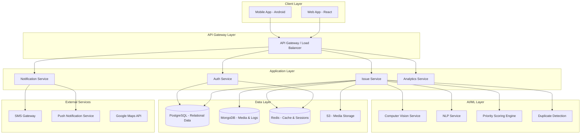
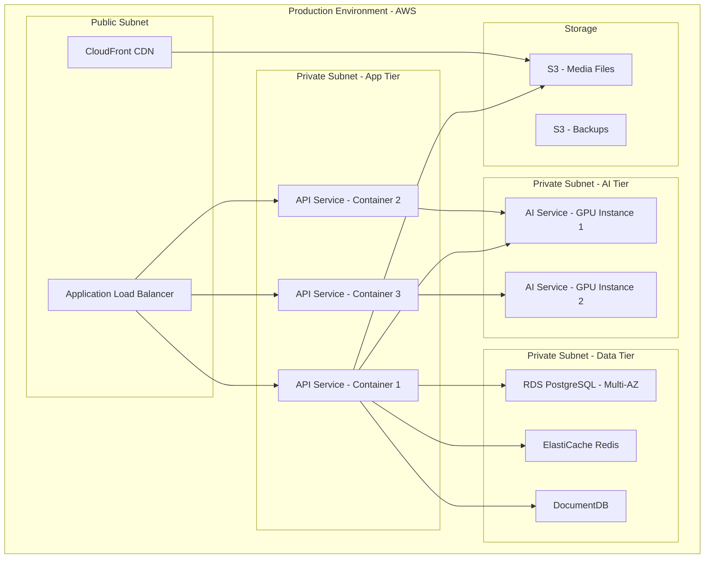

# Design Document: Smart Community Issue Reporting & Resolution System

## Overview

The Smart Community Issue Reporting & Resolution System is a full-stack AI-powered platform designed for Indian smart cities. The system enables citizens to report community issues through mobile and web applications using photos, voice, and text. AI models automatically classify, prioritize, and route issues to appropriate government departments, while providing real-time tracking and public transparency.

### Key Design Principles

1. **AI-First Approach**: Minimize manual intervention through intelligent classification and routing
2. **Mobile-First Design**: Optimize for mobile users with offline capabilities
3. **Transparency**: Public dashboards for community accountability
4. **Scalability**: Support city-scale deployments with 100K+ users
5. **Multi-lingual**: Support Hindi, English, and regional Indian languages
6. **Security**: Government-grade data protection and privacy

### System Boundaries

**In Scope:**
- Citizen mobile and web applications
- AI classification and prioritization engine
- Authority management dashboard
- Public transparency dashboard
- Notification and alerting system
- Authentication and user management

**Out of Scope:**
- Department internal workflow systems
- Payment processing for fines or fees
- Citizen identity verification beyond phone OTP
- Integration with existing government ERP systems (future phase)

## Architecture

### High-Level Architecture



### Technology Stack

#### Frontend
- **Mobile App**: Flutter (single codebase for Android, future iOS)
  - State Management: Riverpod
  - Local Storage: Hive
  - Maps: Google Maps Flutter plugin
  - Camera: camera plugin
  - Audio: flutter_sound
  
- **Web Applications**:
  - Citizen Web: React 18 + TypeScript
  - Authority Dashboard: React 18 + TypeScript + Material-UI
  - Transparency Dashboard: React 18 + TypeScript + Recharts
  - State Management: Redux Toolkit
  - Maps: React Google Maps

#### Backend
- **API Server**: FastAPI (Python 3.11+)
  - Async/await for high concurrency
  - Pydantic for data validation
  - SQLAlchemy for ORM
  - Alembic for migrations
  
- **Authentication**: JWT tokens + Redis sessions
- **API Documentation**: OpenAPI/Swagger auto-generated

#### AI/ML Stack
- **Computer Vision**:
  - Framework: PyTorch 2.0
  - Model: EfficientNet-B3 (fine-tuned on Indian infrastructure dataset)
  - Inference: TorchServe or FastAPI endpoint
  
- **Speech-to-Text**:
  - Model: OpenAI Whisper (medium model)
  - Languages: Hindi, English, Tamil, Telugu, Bengali, Marathi
  
- **NLP Classification**:
  - Model: IndicBERT (fine-tuned for complaint classification)
  - Framework: Hugging Face Transformers
  
- **Duplicate Detection**:
  - Image: Perceptual hashing (pHash) + FAISS vector search
  - Text: Sentence-BERT embeddings + cosine similarity
  - Geo: PostGIS spatial queries

#### Data Layer
- **Primary Database**: PostgreSQL 15
  - PostGIS extension for geospatial queries
  - Full-text search for complaint text
  
- **Document Store**: MongoDB
  - Store AI model predictions and logs
  - Store unstructured metadata
  
- **Cache**: Redis 7
  - Session management
  - Rate limiting
  - Real-time leaderboards
  
- **Object Storage**: AWS S3 / MinIO
  - Photo storage with CDN
  - Audio file storage
  - Backup and archival

#### Infrastructure
- **Cloud Provider**: AWS (can be adapted to GCP/Azure)
- **Compute**: ECS Fargate for containerized services
- **AI Inference**: EC2 GPU instances (g4dn.xlarge) or SageMaker
- **CDN**: CloudFront for media delivery
- **Monitoring**: Prometheus + Grafana
- **Logging**: ELK Stack (Elasticsearch, Logstash, Kibana)
- **CI/CD**: GitHub Actions + Docker

### Deployment Architecture



## Components and Interfaces

### 1. Authentication Service

**Responsibilities:**
- Phone number validation and OTP generation
- OTP verification and session creation
- JWT token generation and validation
- User profile management
- Rate limiting for authentication attempts

**Key Interfaces:**

```python
class AuthenticationService:
    def send_otp(phone_number: str) -> OTPResponse:
        """
        Send OTP to phone number via SMS gateway
        Returns: OTPResponse with request_id and expiry
        """
        
    def verify_otp(phone_number: str, otp: str, request_id: str) -> AuthToken:
        """
        Verify OTP and create user session
        Returns: JWT access token and refresh token
        """
        
    def refresh_token(refresh_token: str) -> AuthToken:
        """
        Generate new access token from refresh token
        """
        
    def logout(user_id: str, token: str) -> bool:
        """
        Invalidate user session and token
        """
```

**Data Models:**

```python
class User:
    id: UUID
    phone_number: str  # Encrypted
    phone_hash: str    # For lookups
    created_at: datetime
    last_login: datetime
    reputation_score: int  # 0-100
    is_active: bool
    preferred_language: str
    notification_preferences: dict

class OTPRequest:
    id: UUID
    phone_hash: str
    otp_hash: str
    attempts: int
    expires_at: datetime
    created_at: datetime
```

### 2. Issue Service

**Responsibilities:**
- Accept issue reports from citizens
- Coordinate with AI services for classification
- Manage issue lifecycle and status transitions
- Handle duplicate detection
- Provide issue search and filtering
- Calculate priority scores

**Key Interfaces:**

```python
class IssueService:
    def create_issue(
        user_id: UUID,
        photo: Optional[File],
        audio: Optional[File],
        text: Optional[str],
        location: GeoPoint
    ) -> Issue:
        """
        Create new issue report
        1. Upload media to S3
        2. Call AI services for classification
        3. Check for duplicates
        4. Calculate priority score
        5. Store in database
        Returns: Created issue with AI predictions
        """
        
    def get_issue(issue_id: UUID, user_id: Optional[UUID]) -> Issue:
        """
        Retrieve issue details
        Filters based on user permissions
        """
        
    def update_issue_status(
        issue_id: UUID,
        new_status: IssueStatus,
        updated_by: UUID,
        notes: Optional[str]
    ) -> Issue:
        """
        Update issue status with audit trail
        Triggers notifications
        """
        
    def assign_issue(
        issue_id: UUID,
        department_id: UUID,
        assigned_by: UUID
    ) -> Issue:
        """
        Assign issue to department
        Updates status to ASSIGNED
        """
        
    def search_issues(
        filters: IssueFilters,
        pagination: Pagination
    ) -> List[Issue]:
        """
        Search issues with filters:
        - category, severity, status
        - geographic bounds
        - date range
        - department
        """
        
    def get_nearby_issues(
        location: GeoPoint,
        radius_meters: int,
        category: Optional[Category]
    ) -> List[Issue]:
        """
        Find issues within radius for duplicate detection
        """
```

**Data Models:**

```python
class Issue:
    id: UUID
    user_id: UUID
    
    # Media
    photo_url: Optional[str]
    audio_url: Optional[str]
    text_description: Optional[str]
    
    # Location
    location: GeoPoint  # PostGIS geography type
    address: str  # Reverse geocoded
    ward: str
    
    # Classification (AI-generated)
    category: Category  # Road, Water, Garbage, etc.
    severity: Severity  # Low, Medium, High, Critical
    classification_confidence: float  # 0.0 to 1.0
    
    # Priority
    priority_score: int  # Calculated value
    
    # Status
    status: IssueStatus
    
    # Assignment
    assigned_department_id: Optional[UUID]
    assigned_at: Optional[datetime]
    assigned_by: Optional[UUID]
    
    # Duplicate handling
    is_duplicate: bool
    parent_issue_id: Optional[UUID]
    duplicate_count: int  # Number of duplicates
    
    # Timestamps
    created_at: datetime
    updated_at: datetime
    verified_at: Optional[datetime]
    resolved_at: Optional[datetime]
    
    # Escalation
    escalation_level: int  # 0 = none, 1 = dept head, 2 = senior mgmt
    escalated_at: Optional[datetime]
    
    # Metadata
    is_emergency: bool
    requires_manual_review: bool

class Category(Enum):
    ROAD = "road"
    WATER = "water"
    GARBAGE = "garbage"
    ELECTRICITY = "electricity"
    SAFETY = "safety"
    SANITATION = "sanitation"
    DRAINAGE = "drainage"
    STREETLIGHT = "streetlight"

class Severity(Enum):
    LOW = "low"
    MEDIUM = "medium"
    HIGH = "high"
    CRITICAL = "critical"

class IssueStatus(Enum):
    SUBMITTED = "submitted"
    VERIFIED = "verified"
    ASSIGNED = "assigned"
    IN_PROGRESS = "in_progress"
    RESOLVED = "resolved"
    REJECTED = "rejected"

class StatusHistory:
    id: UUID
    issue_id: UUID
    from_status: IssueStatus
    to_status: IssueStatus
    changed_by: UUID
    notes: Optional[str]
    changed_at: datetime
```

### 3. Computer Vision Service

**Responsibilities:**
- Classify issue type from uploaded photos
- Detect severity level from visual cues
- Validate image authenticity (fake detection)
- Extract visual features for duplicate detection

**Key Interfaces:**

```python
class ComputerVisionService:
    def classify_image(image_url: str) -> ImageClassification:
        """
        Classify issue category and severity from image
        Uses EfficientNet-B3 fine-tuned model
        Returns: Category, severity, confidence scores
        """
        
    def extract_features(image_url: str) -> np.ndarray:
        """
        Extract feature vector for duplicate detection
        Returns: 512-dimensional embedding
        """
        
    def detect_fake_image(image_url: str) -> FakeDetectionResult:
        """
        Analyze image for manipulation or stock photos
        Checks: EXIF data, error level analysis, reverse image search
        Returns: Authenticity score and flags
        """
        
    def compute_perceptual_hash(image_url: str) -> str:
        """
        Generate perceptual hash for duplicate detection
        Returns: 64-bit pHash string
        """

class ImageClassification:
    category: Category
    category_confidence: float
    severity: Severity
    severity_confidence: float
    top_3_categories: List[Tuple[Category, float]]
    processing_time_ms: int
```

**Model Architecture:**

- **Base Model**: EfficientNet-B3 (pretrained on ImageNet)
- **Fine-tuning Dataset**: 50K+ labeled images of Indian infrastructure issues
- **Output Heads**:
  - Category classification: 8-class softmax
  - Severity classification: 4-class softmax
- **Input**: 300x300 RGB images
- **Augmentation**: Rotation, brightness, contrast, blur (training only)
- **Inference Time**: <3 seconds on GPU, <8 seconds on CPU

### 4. NLP Service

**Responsibilities:**
- Convert speech to text (multilingual)
- Classify issue category from text
- Extract key information (location mentions, urgency keywords)
- Detect spam and abusive content
- Sentiment analysis

**Key Interfaces:**

```python
class NLPService:
    def speech_to_text(
        audio_url: str,
        language: str
    ) -> SpeechToTextResult:
        """
        Convert audio to text using Whisper
        Supports: Hindi, English, Tamil, Telugu, Bengali, Marathi
        Returns: Transcribed text and confidence
        """
        
    def classify_text(text: str, language: str) -> TextClassification:
        """
        Classify issue category from text description
        Uses IndicBERT fine-tuned model
        Returns: Category and confidence
        """
        
    def detect_spam(text: str) -> SpamDetectionResult:
        """
        Detect spam, promotional content, or abuse
        Returns: Spam score and flags
        """
        
    def extract_entities(text: str, language: str) -> List[Entity]:
        """
        Extract named entities (locations, landmarks)
        Returns: List of entities with types
        """

class SpeechToTextResult:
    text: str
    language_detected: str
    confidence: float
    duration_seconds: float
    processing_time_ms: int

class TextClassification:
    category: Category
    confidence: float
    top_3_categories: List[Tuple[Category, float]]
    urgency_keywords: List[str]
    sentiment: str  # positive, negative, neutral
```

**Model Details:**

- **Speech-to-Text**: OpenAI Whisper (medium model, 769M parameters)
  - Supports 99 languages including all major Indian languages
  - Word Error Rate: <15% for Hindi/English
  
- **Text Classification**: IndicBERT (multilingual BERT for Indian languages)
  - Fine-tuned on 30K+ labeled complaint texts
  - Supports code-mixed text (Hinglish)
  
- **Spam Detection**: Lightweight classifier (DistilBERT)
  - Trained on spam patterns, promotional keywords
  - Real-time inference (<100ms)

### 5. Priority Scoring Engine

**Responsibilities:**
- Calculate priority scores for issues
- Update scores based on time and duplicate reports
- Trigger escalations for high-priority unresolved issues

**Priority Score Formula:**

```
Priority Score = Severity_Weight + Location_Risk + Crowd_Factor + Time_Factor

Where:
- Severity_Weight:
  * Critical: 40 points
  * High: 30 points
  * Medium: 20 points
  * Low: 10 points

- Location_Risk: 0-20 points
  * Based on historical issue density
  * High-traffic areas get higher scores
  * Calculated from PostGIS spatial analysis

- Crowd_Factor: 5 points per duplicate report (max 25 points)
  * Indicates community concern level

- Time_Factor: 10 points per day unresolved (max 50 points)
  * Starts after 48 hours
  * Ensures old issues don't get forgotten
```

**Key Interfaces:**

```python
class PriorityScoringEngine:
    def calculate_priority(issue: Issue) -> int:
        """
        Calculate initial priority score
        """
        
    def update_priority(issue_id: UUID) -> int:
        """
        Recalculate priority based on current state
        Called by scheduled job every 6 hours
        """
        
    def get_location_risk_score(location: GeoPoint) -> int:
        """
        Calculate location risk based on historical data
        Uses spatial clustering of past issues
        """
        
    def check_escalation_needed(issue: Issue) -> bool:
        """
        Determine if issue needs escalation
        Rules:
        - Assigned > 72 hours → escalate to dept head
        - In Progress > 7 days → escalate to senior mgmt
        - Critical + unassigned > 1 hour → escalate immediately
        """
```

### 6. Duplicate Detection Service

**Responsibilities:**
- Identify duplicate issue reports
- Link duplicates to original issues
- Update crowd factor in priority scoring

**Detection Strategy:**

1. **Geospatial Filter**: Find issues within 100m radius
2. **Image Similarity**: Compare perceptual hashes (Hamming distance < 10)
3. **Text Similarity**: Compare text embeddings (cosine similarity > 0.8)
4. **Time Window**: Only compare with issues from last 30 days
5. **Category Match**: Must be same category

**Key Interfaces:**

```python
class DuplicateDetectionService:
    def find_duplicates(issue: Issue) -> Optional[UUID]:
        """
        Find potential duplicate issues
        Returns: Parent issue ID if duplicate found
        """
        
    def link_duplicate(
        duplicate_issue_id: UUID,
        parent_issue_id: UUID
    ) -> bool:
        """
        Link duplicate to parent issue
        Updates crowd factor and priority
        """
        
    def compute_image_similarity(
        image1_hash: str,
        image2_hash: str
    ) -> float:
        """
        Calculate Hamming distance between pHashes
        Returns: Similarity score 0.0 to 1.0
        """
        
    def compute_text_similarity(
        text1_embedding: np.ndarray,
        text2_embedding: np.ndarray
    ) -> float:
        """
        Calculate cosine similarity between embeddings
        Returns: Similarity score 0.0 to 1.0
        """
```

### 7. Notification Service

**Responsibilities:**
- Send push notifications to mobile apps
- Send SMS for critical updates
- Send email notifications to authorities
- Manage notification preferences
- Handle notification delivery failures

**Key Interfaces:**

```python
class NotificationService:
    def send_push_notification(
        user_id: UUID,
        title: str,
        body: str,
        data: dict
    ) -> bool:
        """
        Send push notification via Firebase Cloud Messaging
        """
        
    def send_sms(
        phone_number: str,
        message: str
    ) -> bool:
        """
        Send SMS via gateway (e.g., Twilio, AWS SNS)
        """
        
    def send_email(
        email: str,
        subject: str,
        body: str
    ) -> bool:
        """
        Send email notification
        """
        
    def notify_status_change(
        issue: Issue,
        old_status: IssueStatus,
        new_status: IssueStatus
    ) -> None:
        """
        Send appropriate notifications for status change
        Respects user preferences
        """
        
    def notify_escalation(
        issue: Issue,
        escalation_level: int,
        recipients: List[UUID]
    ) -> None:
        """
        Send escalation alerts to authorities
        Uses multiple channels for critical issues
        """
```

**Notification Templates:**

```python
NOTIFICATION_TEMPLATES = {
    "issue_submitted": {
        "title": "Issue Reported Successfully",
        "body": "Your complaint #{issue_id} has been submitted. We'll update you soon."
    },
    "issue_verified": {
        "title": "Issue Verified",
        "body": "Your complaint #{issue_id} has been verified by authorities."
    },
    "issue_assigned": {
        "title": "Issue Assigned",
        "body": "Your complaint #{issue_id} has been assigned to {department}."
    },
    "issue_in_progress": {
        "title": "Work in Progress",
        "body": "Work has started on your complaint #{issue_id}."
    },
    "issue_resolved": {
        "title": "Issue Resolved",
        "body": "Your complaint #{issue_id} has been marked as resolved. Please confirm."
    },
    "escalation_alert": {
        "title": "URGENT: Issue Escalated",
        "body": "Issue #{issue_id} requires immediate attention. Priority: {priority}"
    }
}
```

### 8. Analytics Service

**Responsibilities:**
- Generate daily/weekly/monthly reports
- Calculate performance metrics by department
- Create heatmaps of issue concentration
- Compute area-wise scores for transparency dashboard
- Track resolution time trends

**Key Interfaces:**

```python
class AnalyticsService:
    def generate_daily_report(date: date) -> DailyReport:
        """
        Generate daily statistics report
        """
        
    def get_department_performance(
        department_id: UUID,
        start_date: date,
        end_date: date
    ) -> DepartmentMetrics:
        """
        Calculate performance metrics for department
        """
        
    def get_heatmap_data(
        category: Optional[Category],
        date_range: DateRange
    ) -> List[HeatmapPoint]:
        """
        Get geographic concentration of issues
        Returns: List of lat/lng points with intensity
        """
        
    def calculate_area_score(
        ward: str,
        date_range: DateRange
    ) -> AreaScore:
        """
        Calculate cleanliness/safety score for area
        Based on issue frequency and resolution rate
        """
        
    def get_leaderboard(
        metric: str,  # "resolution_time", "resolved_count"
        limit: int
    ) -> List[LeaderboardEntry]:
        """
        Get top performing wards/departments
        """

class DailyReport:
    date: date
    total_issues: int
    resolved_issues: int
    pending_issues: int
    average_resolution_time_hours: float
    by_category: Dict[Category, int]
    by_severity: Dict[Severity, int]
    emergency_issues: int

class DepartmentMetrics:
    department_id: UUID
    department_name: str
    total_assigned: int
    total_resolved: int
    resolution_rate: float  # percentage
    average_resolution_time_hours: float
    pending_count: int
    escalated_count: int

class AreaScore:
    ward: str
    cleanliness_score: int  # 0-100
    safety_score: int  # 0-100
    total_issues: int
    resolved_issues: int
    average_resolution_time_hours: float
```

## Data Models

### Database Schema (PostgreSQL)

```sql
-- Users table
CREATE TABLE users (
    id UUID PRIMARY KEY DEFAULT gen_random_uuid(),
    phone_hash VARCHAR(64) UNIQUE NOT NULL,
    phone_encrypted TEXT NOT NULL,
    reputation_score INTEGER DEFAULT 50,
    preferred_language VARCHAR(10) DEFAULT 'en',
    notification_preferences JSONB DEFAULT '{}',
    is_active BOOLEAN DEFAULT true,
    created_at TIMESTAMP DEFAULT NOW(),
    last_login TIMESTAMP,
    INDEX idx_phone_hash (phone_hash)
);

-- Issues table
CREATE TABLE issues (
    id UUID PRIMARY KEY DEFAULT gen_random_uuid(),
    user_id UUID REFERENCES users(id),
    
    -- Media
    photo_url TEXT,
    audio_url TEXT,
    text_description TEXT,
    
    -- Location (PostGIS)
    location GEOGRAPHY(POINT, 4326) NOT NULL,
    address TEXT,
    ward VARCHAR(100),
    
    -- Classification
    category VARCHAR(20) NOT NULL,
    severity VARCHAR(20) NOT NULL,
    classification_confidence FLOAT,
    
    -- Priority
    priority_score INTEGER NOT NULL,
    
    -- Status
    status VARCHAR(20) NOT NULL DEFAULT 'submitted',
    
    -- Assignment
    assigned_department_id UUID REFERENCES departments(id),
    assigned_at TIMESTAMP,
    assigned_by UUID REFERENCES users(id),
    
    -- Duplicate handling
    is_duplicate BOOLEAN DEFAULT false,
    parent_issue_id UUID REFERENCES issues(id),
    duplicate_count INTEGER DEFAULT 0,
    
    -- Timestamps
    created_at TIMESTAMP DEFAULT NOW(),
    updated_at TIMESTAMP DEFAULT NOW(),
    verified_at TIMESTAMP,
    resolved_at TIMESTAMP,
    
    -- Escalation
    escalation_level INTEGER DEFAULT 0,
    escalated_at TIMESTAMP,
    
    -- Flags
    is_emergency BOOLEAN DEFAULT false,
    requires_manual_review BOOLEAN DEFAULT false,
    
    INDEX idx_location USING GIST (location),
    INDEX idx_status (status),
    INDEX idx_category (category),
    INDEX idx_created_at (created_at DESC),
    INDEX idx_priority (priority_score DESC),
    INDEX idx_ward (ward)
);

-- Status history table
CREATE TABLE status_history (
    id UUID PRIMARY KEY DEFAULT gen_random_uuid(),
    issue_id UUID REFERENCES issues(id) ON DELETE CASCADE,
    from_status VARCHAR(20),
    to_status VARCHAR(20) NOT NULL,
    changed_by UUID REFERENCES users(id),
    notes TEXT,
    changed_at TIMESTAMP DEFAULT NOW(),
    INDEX idx_issue_id (issue_id),
    INDEX idx_changed_at (changed_at DESC)
);

-- Departments table
CREATE TABLE departments (
    id UUID PRIMARY KEY DEFAULT gen_random_uuid(),
    name VARCHAR(100) NOT NULL,
    category VARCHAR(20) NOT NULL,  -- Primary category handled
    email VARCHAR(255),
    phone VARCHAR(20),
    head_user_id UUID REFERENCES users(id),
    is_active BOOLEAN DEFAULT true,
    created_at TIMESTAMP DEFAULT NOW()
);

-- Authority users table
CREATE TABLE authority_users (
    id UUID PRIMARY KEY DEFAULT gen_random_uuid(),
    user_id UUID REFERENCES users(id),
    department_id UUID REFERENCES departments(id),
    role VARCHAR(50) NOT NULL,  -- 'officer', 'supervisor', 'admin'
    permissions JSONB DEFAULT '{}',
    is_active BOOLEAN DEFAULT true,
    created_at TIMESTAMP DEFAULT NOW()
);

-- Image features table (for duplicate detection)
CREATE TABLE image_features (
    id UUID PRIMARY KEY DEFAULT gen_random_uuid(),
    issue_id UUID REFERENCES issues(id) ON DELETE CASCADE,
    perceptual_hash VARCHAR(64) NOT NULL,
    feature_vector FLOAT[] NOT NULL,  -- 512-dimensional
    created_at TIMESTAMP DEFAULT NOW(),
    INDEX idx_issue_id (issue_id),
    INDEX idx_phash (perceptual_hash)
);

-- Text embeddings table (for duplicate detection)
CREATE TABLE text_embeddings (
    id UUID PRIMARY KEY DEFAULT gen_random_uuid(),
    issue_id UUID REFERENCES issues(id) ON DELETE CASCADE,
    embedding FLOAT[] NOT NULL,  -- 768-dimensional
    created_at TIMESTAMP DEFAULT NOW(),
    INDEX idx_issue_id (issue_id)
);

-- Notifications table
CREATE TABLE notifications (
    id UUID PRIMARY KEY DEFAULT gen_random_uuid(),
    user_id UUID REFERENCES users(id),
    issue_id UUID REFERENCES issues(id),
    type VARCHAR(50) NOT NULL,
    title TEXT NOT NULL,
    body TEXT NOT NULL,
    data JSONB DEFAULT '{}',
    is_read BOOLEAN DEFAULT false,
    sent_at TIMESTAMP DEFAULT NOW(),
    INDEX idx_user_id (user_id),
    INDEX idx_sent_at (sent_at DESC)
);
```

### API Endpoints

#### Authentication APIs

```
POST /api/v1/auth/send-otp
Request: { "phone_number": "+919876543210" }
Response: { "request_id": "uuid", "expires_in": 300 }

POST /api/v1/auth/verify-otp
Request: { "phone_number": "+919876543210", "otp": "123456", "request_id": "uuid" }
Response: { "access_token": "jwt", "refresh_token": "jwt", "user": {...} }

POST /api/v1/auth/refresh
Request: { "refresh_token": "jwt" }
Response: { "access_token": "jwt" }

POST /api/v1/auth/logout
Headers: Authorization: Bearer <token>
Response: { "success": true }
```

#### Issue APIs

```
POST /api/v1/issues
Headers: Authorization: Bearer <token>
Content-Type: multipart/form-data
Request: {
  "photo": File,
  "audio": File,
  "text": "string",
  "latitude": 12.9716,
  "longitude": 77.5946
}
Response: {
  "issue": {
    "id": "uuid",
    "category": "road",
    "severity": "high",
    "priority_score": 45,
    "status": "submitted",
    "is_duplicate": false,
    ...
  }
}

GET /api/v1/issues/{issue_id}
Headers: Authorization: Bearer <token>
Response: { "issue": {...} }

GET /api/v1/issues/my-issues
Headers: Authorization: Bearer <token>
Query: ?page=1&limit=20&status=pending
Response: {
  "issues": [...],
  "total": 100,
  "page": 1,
  "pages": 5
}

PATCH /api/v1/issues/{issue_id}/status
Headers: Authorization: Bearer <token>
Request: { "status": "in_progress", "notes": "Work started" }
Response: { "issue": {...} }

POST /api/v1/issues/{issue_id}/assign
Headers: Authorization: Bearer <token>
Request: { "department_id": "uuid" }
Response: { "issue": {...} }

GET /api/v1/issues/search
Headers: Authorization: Bearer <token>
Query: ?category=road&severity=high&status=pending&ward=Ward1&page=1
Response: { "issues": [...], "total": 50 }

GET /api/v1/issues/nearby
Query: ?lat=12.9716&lng=77.5946&radius=1000&category=road
Response: { "issues": [...] }
```

#### Analytics APIs

```
GET /api/v1/analytics/daily-report
Headers: Authorization: Bearer <token>
Query: ?date=2024-01-15
Response: { "report": {...} }

GET /api/v1/analytics/department-performance
Headers: Authorization: Bearer <token>
Query: ?department_id=uuid&start_date=2024-01-01&end_date=2024-01-31
Response: { "metrics": {...} }

GET /api/v1/analytics/heatmap
Query: ?category=road&start_date=2024-01-01&end_date=2024-01-31
Response: { "points": [{"lat": 12.97, "lng": 77.59, "intensity": 10}, ...] }

GET /api/v1/analytics/area-scores
Query: ?ward=Ward1
Response: { "score": {...} }

GET /api/v1/analytics/leaderboard
Query: ?metric=resolution_time&limit=10
Response: { "entries": [...] }
```

#### Public APIs (No Auth Required)

```
GET /api/v1/public/issues
Query: ?category=road&ward=Ward1&page=1
Response: { "issues": [...] }  // Anonymized data

GET /api/v1/public/statistics
Response: {
  "total_issues": 10000,
  "resolved_issues": 8500,
  "pending_issues": 1500,
  "average_resolution_hours": 48,
  "by_category": {...}
}

GET /api/v1/public/leaderboard
Response: { "wards": [...] }
```


## Correctness Properties

*A property is a characteristic or behavior that should hold true across all valid executions of a system—essentially, a formal statement about what the system should do. Properties serve as the bridge between human-readable specifications and machine-verifiable correctness guarantees.*

### Property 1: OTP Verification Success

*For any* valid phone number and correct OTP pair, when the OTP is submitted within the 5-minute expiry window, the Authentication_Service should grant access and return valid JWT tokens.

**Validates: Requirements 1.2**

### Property 2: OTP Retry Limit Enforcement

*For any* phone number, when incorrect OTPs are submitted, the Authentication_Service should allow exactly 3 retry attempts before blocking further attempts, and each failed attempt should increment the retry counter.

**Validates: Requirements 1.3**

### Property 3: OTP Lockout After Exhausted Retries

*For any* phone number, when 3 incorrect OTP attempts have been made, the Authentication_Service should block all subsequent login attempts for 15 minutes regardless of OTP correctness.

**Validates: Requirements 1.4**

### Property 4: Session Token Validity Duration

*For any* authenticated user, the issued JWT access token should remain valid for 30 days without requiring re-authentication, and token validation should succeed within this period.

**Validates: Requirements 1.5**

### Property 5: Image Format and Size Validation

*For any* uploaded file, the Citizen_App should accept the file if and only if it is in JPEG, PNG, or HEIC format and the file size is at most 10MB, rejecting all other files.

**Validates: Requirements 2.1**

### Property 6: Image Classification Returns Valid Category

*For any* submitted photo, the AI_Classifier should return exactly one of the eight valid categories (Road, Water, Garbage, Electricity, Safety, Sanitation, Drainage, Streetlight).

**Validates: Requirements 2.3, 5.1**

### Property 7: Image Compression Reduces File Size

*For any* uploaded image, the compression function should reduce the file size by at least 50% while producing a valid image file.

**Validates: Requirements 2.4**

### Property 8: Offline Report Queueing

*For any* issue report created while network connectivity is unavailable, the Citizen_App should store the report in the local queue, and when connectivity is restored, the report should be automatically submitted to the server.

**Validates: Requirements 2.5, 17.1, 17.2**

### Property 9: Audio Duration Validation

*For any* audio recording, the Citizen_App should accept the recording if and only if its duration is at most 2 minutes, rejecting longer recordings.

**Validates: Requirements 3.1**

### Property 10: Speech-to-Text Produces Valid Output

*For any* audio file submitted for transcription, the AI_Classifier should return either a non-empty text string with a confidence score, or an error indicating poor audio quality.

**Validates: Requirements 3.3, 3.5**

### Property 11: Text Length Validation

*For any* text complaint, the Citizen_App should accept the text if and only if its length is between 10 and 500 characters (inclusive), rejecting text outside this range.

**Validates: Requirements 4.1**

### Property 12: Text Classification Returns Valid Category

*For any* submitted text description, the AI_Classifier should return exactly one of the eight valid categories with a confidence score between 0.0 and 1.0.

**Validates: Requirements 4.2**

### Property 13: Spam and Profanity Rejection

*For any* text input, if the text contains spam patterns, promotional content, or profanity, the Citizen_App should reject the submission and return an appropriate error message.

**Validates: Requirements 4.3, 4.5, 14.3**

### Property 14: Low Confidence Manual Review Flagging

*For any* issue classification, if the confidence score is below 0.70 (70%), the AI_Classifier should set the requires_manual_review flag to true.

**Validates: Requirements 5.2**

### Property 15: Severity Assignment Returns Valid Level

*For any* classified issue, the AI_Classifier should assign exactly one of the four valid severity levels (Low, Medium, High, Critical).

**Validates: Requirements 5.3**

### Property 16: Priority Score Calculation Formula

*For any* issue, the calculated priority_score should equal the sum of: severity_weight (Critical=40, High=30, Medium=20, Low=10) + location_risk_score (0-20) + (duplicate_count × 5, max 25) + time_factor (10 points per day after 48 hours, max 50).

**Validates: Requirements 6.1, 6.2, 6.3, 6.4, 6.5, 6.6, 6.7**

### Property 17: Duplicate Detection Geospatial Filtering

*For any* new issue, the duplicate detection algorithm should only compare against existing issues that are within 100 meters of the new issue's location and were created within the last 30 days.

**Validates: Requirements 7.1**

### Property 18: Duplicate Marking Based on Similarity

*For any* pair of issues within 50 meters of each other, if their image perceptual hash similarity exceeds 80% and they have the same category, the newer issue should be marked as a duplicate and linked to the older issue.

**Validates: Requirements 7.2, 7.3**

### Property 19: Duplicate Count Increments Priority

*For any* issue marked as the parent of duplicates, each time a duplicate is linked, the duplicate_count should increment by 1 and the priority_score should increase by 5 points.

**Validates: Requirements 7.4**

### Property 20: Status Change Triggers Notification

*For any* issue, when its status changes from one value to another, the Notification_Service should send a push notification to the reporting citizen containing the issue ID and new status.

**Validates: Requirements 8.1, 20.1**

### Property 21: Issue Status is Always Valid

*For any* issue at any point in time, its status field should contain exactly one of the five valid states: Submitted, Verified, Assigned, In Progress, or Resolved.

**Validates: Requirements 8.2**

### Property 22: Issue Details Contain Required Fields

*For any* issue retrieved by a citizen, the response should include at minimum: current status, assigned department (if assigned), creation timestamp, and location data.

**Validates: Requirements 8.3**

### Property 23: Status History Audit Trail

*For any* issue, every status change should create a new entry in the status_history table with the from_status, to_status, changed_by user ID, and timestamp.

**Validates: Requirements 8.4**

### Property 24: Issue Filtering Correctness

*For any* set of filter criteria (category, severity, status, geographic bounds), the search results should contain only issues that match all specified criteria, and should not exclude any issues that match.

**Validates: Requirements 9.2**

### Property 25: Issue Assignment Updates Status and Records Metadata

*For any* issue, when it is assigned to a department, the issue's status should change to "Assigned", the assigned_department_id should be set, the assigned_at timestamp should be recorded, and the assigned_by field should contain the assigning authority's user ID.

**Validates: Requirements 9.5, 10.1**

### Property 26: In-Progress Issues Cannot Be Reassigned Without Approval

*For any* issue with status "In Progress", an attempt to reassign it to a different department should fail unless the requesting user has supervisor-level permissions.

**Validates: Requirements 10.2**

### Property 27: Assignment Triggers Department Notification

*For any* issue, when it is assigned to a department, the Notification_Service should send notifications (email and SMS) to all users in that department within the notification delivery window.

**Validates: Requirements 10.3**

### Property 28: Unassigned Issue Escalation

*For any* issue, if it remains in "Submitted" or "Verified" status for more than 24 hours without being assigned, the system should create an escalation alert and notify supervisors.

**Validates: Requirements 10.5**

### Property 29: Daily Report Aggregation Accuracy

*For any* given date, the daily report should show total_issues equal to the count of issues created on that date, resolved_issues equal to the count resolved on that date, and average_resolution_time calculated as the mean of (resolved_at - created_at) for all issues resolved that day.

**Validates: Requirements 11.1**

### Property 30: Resolution Time Statistics by Department

*For any* department and time range, the calculated average resolution time should equal the mean of (resolved_at - created_at) for all issues assigned to that department and resolved within the time range.

**Validates: Requirements 11.3**

### Property 31: Transparency Dashboard Live Counts

*For any* point in time, the Transparency_Dashboard should display total_issues as the count of all issues, resolved_issues as the count with status "Resolved", and pending_issues as the count with status not equal to "Resolved".

**Validates: Requirements 12.1**

### Property 32: Area Score Calculation

*For any* geographic area (ward), the cleanliness_score and safety_score should be calculated based on the formula: score = 100 - (issue_frequency_factor × 30) - (average_resolution_time_factor × 70), where factors are normalized to 0-1 range.

**Validates: Requirements 12.3**

### Property 33: Leaderboard Ranking Correctness

*For any* leaderboard based on a metric (e.g., resolution_time, resolved_count), the entries should be sorted in the correct order (ascending for time, descending for count), and each entry should contain accurate metric values.

**Validates: Requirements 12.4**

### Property 34: Critical Severity Activates Emergency Mode

*For any* issue, if the AI_Classifier assigns severity level "Critical", the is_emergency flag should be set to true automatically.

**Validates: Requirements 13.1**

### Property 35: Emergency Mode Triggers Immediate Alerts

*For any* issue with is_emergency flag set to true, the Notification_Service should immediately send alerts to all relevant authorities via SMS, email, and push notification.

**Validates: Requirements 13.2, 13.3**

### Property 36: Emergency Acknowledgment Tracking

*For any* emergency issue, the system should track whether it has been acknowledged by an authority, and if not acknowledged within 15 minutes, should escalate to senior officials.

**Validates: Requirements 13.4, 13.5**

### Property 37: Image Authenticity Analysis

*For any* uploaded image, the AI_Classifier should perform authenticity analysis and return an authenticity_score between 0.0 and 1.0, with scores below 0.5 flagging the image for manual review.

**Validates: Requirements 14.1**

### Property 38: High-Frequency Submission Flagging

*For any* user, if they submit more than 5 issues within a 1-hour window, the system should flag their account for review and set a rate_limit_exceeded flag.

**Validates: Requirements 14.2**

### Property 39: Reputation Score Maintenance

*For any* user, the reputation_score should be updated after each issue resolution based on the formula: new_score = old_score + (confirmed_resolution × 5) - (false_report × 10), bounded to the range [0, 100].

**Validates: Requirements 14.4**

### Property 40: Low Reputation Manual Verification

*For any* user with reputation_score below 30, all their new issue submissions should have the requires_manual_review flag set to true.

**Validates: Requirements 14.5**

### Property 41: Time-Based Escalation for Assigned Issues

*For any* issue with status "Assigned", if the current time is more than 72 hours after assigned_at, the system should automatically escalate to the department head (escalation_level = 1).

**Validates: Requirements 15.1**

### Property 42: Time-Based Escalation for In-Progress Issues

*For any* issue with status "In Progress", if the current time is more than 7 days after the status was set, the system should automatically escalate to senior management (escalation_level = 2).

**Validates: Requirements 15.2**

### Property 43: Escalation Notification to Multiple Recipients

*For any* escalation event, the Notification_Service should send notifications to both the original assignee and the escalation recipient (department head or senior management).

**Validates: Requirements 15.3**

### Property 44: Escalation Audit Logging

*For any* escalation event, the system should create a log entry containing the issue_id, escalation_level, timestamp, and reason for escalation.

**Validates: Requirements 15.4**

### Property 45: Cross-Platform Data Synchronization

*For any* user, when they access their account from different platforms (mobile app, web app), all their issue data, preferences, and session state should be consistent across platforms.

**Validates: Requirements 16.3**

### Property 46: Offline Status Indication

*For any* time when network connectivity is unavailable, the Citizen_App should set an offline_mode flag to true and display this state in the UI.

**Validates: Requirements 17.3**

### Property 47: Offline Data Access

*For any* user's previously submitted issues, the data should be accessible from local storage when the app is in offline mode, without requiring network connectivity.

**Validates: Requirements 17.4**

### Property 48: Local Storage Limit Enforcement

*For any* user, the Citizen_App should store at most 50 unsynced reports in local storage, and should prevent creating new reports if this limit is reached until synchronization occurs.

**Validates: Requirements 17.5**

### Property 49: Phone Number Encryption

*For any* user record in the database, the phone_encrypted field should contain an AES-256 encrypted value, and the plaintext phone number should never be stored directly.

**Validates: Requirements 18.1**

### Property 50: Role-Based Access Control

*For any* API endpoint requiring authorization, the system should verify that the requesting user has the required role/permission, and should reject requests from users without proper authorization with a 403 Forbidden response.

**Validates: Requirements 18.3**

### Property 51: Anonymous Reporting Support

*For any* issue report, if the user chooses anonymous reporting, the issue should be created without storing the user_id, and the user's identity should not be revealed to authorities.

**Validates: Requirements 18.4**

### Property 52: Account Deletion Removes PII

*For any* user who requests account deletion, all personally identifiable information (phone number, name, email) should be removed from the database within 30 days, while preserving anonymized issue data for analytics.

**Validates: Requirements 18.5**

### Property 53: Critical Status Change SMS Notification

*For any* issue, when its status changes to "Assigned" or "Resolved", the Notification_Service should send an SMS notification to the reporting citizen in addition to push notifications.

**Validates: Requirements 20.2**

### Property 54: Notification Preference Respect

*For any* notification event, the Notification_Service should check the user's notification_preferences and only send notifications through channels that the user has enabled.

**Validates: Requirements 20.3**

### Property 55: Notification Retry with Exponential Backoff

*For any* failed notification delivery, the Notification_Service should retry up to 3 times with exponential backoff delays (e.g., 1 second, 2 seconds, 4 seconds), and mark the notification as failed if all retries are exhausted.

**Validates: Requirements 20.5**


## Error Handling

### Error Response Format

All API errors should follow a consistent JSON structure:

```json
{
  "error": {
    "code": "ERROR_CODE",
    "message": "Human-readable error message",
    "details": {
      "field": "specific_field",
      "reason": "detailed explanation"
    },
    "request_id": "uuid-for-tracking"
  }
}
```

### Error Categories and Handling Strategies

#### 1. Authentication Errors

**Scenarios:**
- Invalid phone number format
- OTP expired
- OTP incorrect
- Too many retry attempts
- Invalid or expired JWT token

**Handling:**
- Return 401 Unauthorized for authentication failures
- Return 429 Too Many Requests for rate limiting
- Log all authentication failures for security monitoring
- Implement exponential backoff for repeated failures
- Clear client-side tokens on 401 responses

**Example:**
```json
{
  "error": {
    "code": "OTP_EXPIRED",
    "message": "The OTP has expired. Please request a new one.",
    "details": {
      "expires_at": "2024-01-15T10:30:00Z"
    }
  }
}
```

#### 2. Validation Errors

**Scenarios:**
- Image file too large or wrong format
- Audio recording too long
- Text description too short or too long
- Missing required fields
- Invalid geographic coordinates

**Handling:**
- Return 400 Bad Request with specific field errors
- Validate on both client and server side
- Provide clear guidance on valid input ranges
- Sanitize all user inputs to prevent injection attacks

**Example:**
```json
{
  "error": {
    "code": "VALIDATION_ERROR",
    "message": "Invalid input data",
    "details": {
      "field": "photo",
      "reason": "File size exceeds 10MB limit",
      "max_size_mb": 10,
      "actual_size_mb": 15.3
    }
  }
}
```

#### 3. AI Service Errors

**Scenarios:**
- Image classification model unavailable
- Speech-to-text service timeout
- Low confidence classification
- Corrupted or unreadable media files

**Handling:**
- Return 503 Service Unavailable for model downtime
- Implement circuit breaker pattern for AI service calls
- Fall back to manual review queue when AI fails
- Cache recent predictions to handle temporary outages
- Set requires_manual_review flag for low confidence

**Example:**
```json
{
  "error": {
    "code": "AI_SERVICE_UNAVAILABLE",
    "message": "Classification service is temporarily unavailable",
    "details": {
      "service": "computer_vision",
      "fallback": "Issue queued for manual review"
    }
  }
}
```

#### 4. Resource Not Found Errors

**Scenarios:**
- Issue ID doesn't exist
- User trying to access another user's private data
- Department ID invalid
- Deleted or archived resources

**Handling:**
- Return 404 Not Found for missing resources
- Return 403 Forbidden for authorization failures
- Don't reveal existence of resources user can't access
- Log suspicious access attempts

#### 5. Duplicate Detection Errors

**Scenarios:**
- Duplicate issue detected
- Similar issue already reported

**Handling:**
- Return 409 Conflict with link to original issue
- Allow user to confirm if it's truly a different issue
- Increment duplicate count on original issue
- Notify user that their report strengthens the original

**Example:**
```json
{
  "error": {
    "code": "DUPLICATE_ISSUE",
    "message": "A similar issue has already been reported nearby",
    "details": {
      "original_issue_id": "uuid",
      "similarity_score": 0.87,
      "distance_meters": 45,
      "original_status": "in_progress"
    }
  }
}
```

#### 6. Rate Limiting Errors

**Scenarios:**
- Too many API requests in short time
- Too many issue submissions from one user
- Spam detection triggered

**Handling:**
- Return 429 Too Many Requests
- Include Retry-After header
- Implement sliding window rate limiting
- Flag accounts for review after repeated violations

#### 7. External Service Failures

**Scenarios:**
- SMS gateway failure
- Email service unavailable
- Maps API quota exceeded
- S3 upload failure

**Handling:**
- Implement retry logic with exponential backoff
- Queue notifications for later delivery
- Use fallback services when available
- Degrade gracefully (e.g., skip reverse geocoding if Maps API fails)
- Alert operations team for critical service failures

#### 8. Database Errors

**Scenarios:**
- Connection pool exhausted
- Query timeout
- Constraint violations
- Deadlocks

**Handling:**
- Return 500 Internal Server Error (don't expose DB details)
- Implement connection pooling with health checks
- Use database transactions for multi-step operations
- Implement retry logic for transient failures
- Log all database errors for investigation

#### 9. Escalation and Emergency Errors

**Scenarios:**
- Emergency issue not acknowledged in time
- Escalation notification failure
- No available authorities to assign

**Handling:**
- Retry escalation notifications multiple times
- Use multiple channels (SMS + email + push)
- Escalate to higher levels if lower levels unresponsive
- Create high-priority alerts in monitoring system
- Maintain audit trail of all escalation attempts

### Error Monitoring and Alerting

**Logging Strategy:**
- Log all errors with severity levels (ERROR, WARN, INFO)
- Include request_id for tracing across services
- Log user_id (hashed) for user-specific issues
- Never log sensitive data (passwords, full phone numbers, OTPs)

**Alerting Thresholds:**
- Alert if error rate exceeds 5% of requests
- Alert if AI service latency exceeds 10 seconds
- Alert if any emergency issue is not acknowledged within 15 minutes
- Alert if database connection pool utilization exceeds 80%
- Alert if notification delivery failure rate exceeds 10%

**Error Recovery:**
- Implement dead letter queues for failed async operations
- Provide admin tools to manually retry failed operations
- Maintain error metrics dashboard for operations team
- Implement automated recovery for common failure scenarios

## Testing Strategy

### Overview

The testing strategy employs a dual approach combining property-based testing for universal correctness guarantees with unit testing for specific examples and edge cases. This comprehensive approach ensures both broad input coverage and targeted validation of critical scenarios.

### Property-Based Testing

**Framework Selection:**
- **Python Backend**: Hypothesis (mature, well-integrated with pytest)
- **Flutter Mobile**: Dart's built-in test framework with custom property generators
- **React Web**: fast-check (TypeScript-compatible, comprehensive)

**Configuration:**
- Minimum 100 iterations per property test (due to randomization)
- Seed-based reproducibility for failed test cases
- Shrinking enabled to find minimal failing examples
- Timeout: 30 seconds per property test

**Property Test Organization:**

Each property test must:
1. Reference its design document property number
2. Use the tag format: `Feature: citizen-complaint-platform, Property {N}: {property_text}`
3. Generate diverse random inputs covering edge cases
4. Assert the universal property holds for all generated inputs

**Example Property Test Structure (Python/Hypothesis):**

```python
from hypothesis import given, strategies as st
import pytest

# Feature: citizen-complaint-platform, Property 16: Priority Score Calculation Formula
@given(
    severity=st.sampled_from(['low', 'medium', 'high', 'critical']),
    location_risk=st.integers(min_value=0, max_value=20),
    duplicate_count=st.integers(min_value=0, max_value=10),
    days_unresolved=st.integers(min_value=0, max_value=30)
)
def test_priority_score_calculation_formula(severity, location_risk, duplicate_count, days_unresolved):
    """
    Property 16: For any issue, the calculated priority_score should equal
    the sum of severity_weight + location_risk + crowd_factor + time_factor
    """
    severity_weights = {'low': 10, 'medium': 20, 'high': 30, 'critical': 40}
    
    issue = create_test_issue(
        severity=severity,
        location_risk=location_risk,
        duplicate_count=duplicate_count,
        created_at=datetime.now() - timedelta(days=days_unresolved)
    )
    
    expected_score = (
        severity_weights[severity] +
        location_risk +
        min(duplicate_count * 5, 25) +
        (max(days_unresolved - 2, 0) * 10 if days_unresolved > 2 else 0)
    )
    
    actual_score = calculate_priority_score(issue)
    
    assert actual_score == expected_score, \
        f"Priority score mismatch: expected {expected_score}, got {actual_score}"
```

**Property Test Coverage:**

All 55 correctness properties must have corresponding property-based tests:
- Authentication properties (1-4): Test with random phone numbers, OTPs, timestamps
- Validation properties (5, 9, 11): Test with random file sizes, formats, text lengths
- Classification properties (6, 12, 15): Test with diverse inputs, verify output validity
- Priority and scoring properties (16, 19, 32): Test formula correctness with random values
- Status and workflow properties (21-28): Test state transitions with random sequences
- Notification properties (20, 27, 53-55): Test delivery logic with random events
- Security properties (49-52): Test encryption, authorization with random users/roles

### Unit Testing

**Purpose:**
Unit tests complement property tests by:
- Testing specific examples that demonstrate correct behavior
- Validating edge cases and boundary conditions
- Testing integration points between components
- Verifying error handling for specific scenarios

**Framework Selection:**
- **Python Backend**: pytest with pytest-asyncio for async tests
- **Flutter Mobile**: flutter_test package
- **React Web**: Jest + React Testing Library

**Unit Test Categories:**

#### 1. Example-Based Tests

Test specific scenarios mentioned in requirements:

```python
def test_critical_issue_activates_emergency_mode():
    """Example: Critical severity should set emergency flag"""
    issue = create_issue(severity='critical')
    assert issue.is_emergency == True

def test_resolved_issue_requests_feedback():
    """Example: Resolved issues should trigger feedback request"""
    issue = create_issue(status='in_progress')
    issue.update_status('resolved')
    assert feedback_request_sent(issue.id) == True
```

#### 2. Edge Case Tests

Test boundary conditions and corner cases:

```python
def test_text_exactly_10_characters_accepted():
    """Edge case: Minimum valid text length"""
    text = "a" * 10
    assert validate_text_length(text) == True

def test_text_exactly_500_characters_accepted():
    """Edge case: Maximum valid text length"""
    text = "a" * 500
    assert validate_text_length(text) == True

def test_text_9_characters_rejected():
    """Edge case: Just below minimum"""
    text = "a" * 9
    assert validate_text_length(text) == False

def test_empty_duplicate_count_priority():
    """Edge case: Priority calculation with zero duplicates"""
    issue = create_issue(duplicate_count=0)
    priority = calculate_priority_score(issue)
    assert priority >= 10  # At least severity weight
```

#### 3. Error Condition Tests

Test error handling and failure scenarios:

```python
def test_expired_otp_rejected():
    """Error: Expired OTP should be rejected"""
    otp_request = create_otp_request(expires_at=datetime.now() - timedelta(minutes=1))
    result = verify_otp(otp_request.phone, "123456", otp_request.id)
    assert result.success == False
    assert result.error_code == "OTP_EXPIRED"

def test_ai_service_unavailable_queues_for_manual_review():
    """Error: AI failure should trigger manual review"""
    with mock_ai_service_down():
        issue = create_issue(photo="test.jpg")
        assert issue.requires_manual_review == True

def test_notification_retry_on_failure():
    """Error: Failed notifications should be retried"""
    with mock_notification_failure():
        send_notification(user_id="test", message="test")
        assert get_retry_count("test") == 1
```

#### 4. Integration Tests

Test interactions between components:

```python
@pytest.mark.integration
def test_issue_creation_end_to_end():
    """Integration: Full issue creation workflow"""
    # Upload photo
    photo_url = upload_photo("test_image.jpg")
    
    # Create issue
    issue = create_issue(
        photo_url=photo_url,
        text="Pothole on main street",
        location=(12.9716, 77.5946)
    )
    
    # Verify AI classification ran
    assert issue.category in VALID_CATEGORIES
    assert issue.severity in VALID_SEVERITIES
    
    # Verify duplicate detection ran
    assert issue.is_duplicate is not None
    
    # Verify notification sent
    assert notification_sent(issue.user_id, "issue_submitted")

@pytest.mark.integration
def test_escalation_workflow():
    """Integration: Time-based escalation"""
    # Create assigned issue
    issue = create_issue(status='assigned', assigned_at=datetime.now() - timedelta(hours=73))
    
    # Run escalation job
    run_escalation_check()
    
    # Verify escalation occurred
    issue = get_issue(issue.id)
    assert issue.escalation_level == 1
    assert escalation_notification_sent(issue.assigned_department_id)
```

### Test Coverage Goals

**Minimum Coverage Targets:**
- Overall code coverage: 80%
- Critical paths (authentication, issue creation, priority calculation): 95%
- Error handling code: 90%
- AI service integration: 70% (mocked tests)

**Coverage Exclusions:**
- Auto-generated code (migrations, ORM models)
- Configuration files
- Third-party library wrappers

### Testing Pyramid

```
        /\
       /  \
      / E2E \          10% - End-to-end tests (critical user flows)
     /______\
    /        \
   /Integration\       20% - Integration tests (component interactions)
  /____________\
 /              \
/   Unit + PBT   \     70% - Unit tests + Property-based tests
/__________________\
```

### Continuous Integration

**CI Pipeline:**
1. Lint and format check (Black, ESLint, dart format)
2. Type checking (mypy for Python, TypeScript compiler)
3. Unit tests (fast, run on every commit)
4. Property-based tests (run on every commit, 100 iterations)
5. Integration tests (run on PR, full database)
6. E2E tests (run nightly, full stack)
7. Coverage report generation
8. Security scanning (Bandit, npm audit)

**Test Execution Time Targets:**
- Unit tests: < 2 minutes
- Property tests: < 5 minutes
- Integration tests: < 10 minutes
- Full test suite: < 20 minutes

### Test Data Management

**Strategy:**
- Use factories (factory_boy, faker) for generating test data
- Maintain seed data for consistent integration tests
- Use database transactions for test isolation
- Clean up test data after each test run
- Use separate test databases (never test against production)

**Test Data Generators:**

```python
from faker import Faker
import factory

fake = Faker(['en_IN', 'hi_IN'])  # Indian locales

class UserFactory(factory.Factory):
    class Meta:
        model = User
    
    phone_number = factory.LazyFunction(lambda: fake.phone_number())
    preferred_language = factory.Iterator(['en', 'hi', 'ta', 'te'])
    reputation_score = factory.Faker('random_int', min=0, max=100)

class IssueFactory(factory.Factory):
    class Meta:
        model = Issue
    
    category = factory.Iterator(VALID_CATEGORIES)
    severity = factory.Iterator(VALID_SEVERITIES)
    location = factory.LazyFunction(
        lambda: (fake.latitude(), fake.longitude())
    )
    text_description = factory.Faker('sentence', nb_words=20)
```

### Performance Testing

**Load Testing:**
- Use Locust or k6 for load testing
- Simulate 10,000 concurrent users
- Test critical endpoints: issue creation, search, map loading
- Measure response times under load
- Identify bottlenecks and optimize

**Stress Testing:**
- Test system behavior at 2x expected load
- Verify graceful degradation
- Test recovery after overload

**AI Model Performance:**
- Benchmark inference time for each model
- Test with various input sizes
- Measure GPU vs CPU performance
- Optimize batch processing

### Security Testing

**Automated Security Scans:**
- SAST (Static Application Security Testing): Bandit, Semgrep
- Dependency vulnerability scanning: Safety, npm audit
- Container scanning: Trivy, Clair

**Manual Security Testing:**
- Penetration testing (quarterly)
- Authentication bypass attempts
- SQL injection testing
- XSS and CSRF testing
- API authorization testing
- Rate limiting verification

### Monitoring and Observability in Tests

**Test Instrumentation:**
- Log test execution times
- Track flaky tests (tests that fail intermittently)
- Monitor property test shrinking iterations
- Alert on test suite duration increases

**Test Quality Metrics:**
- Test execution time trends
- Test failure rates
- Code coverage trends
- Mutation testing scores (optional)

## Deployment and Operations

### Deployment Strategy

**Environment Progression:**
1. Development (local)
2. Staging (mirrors production)
3. Production (blue-green deployment)

**Deployment Process:**
1. Run full test suite
2. Build Docker images
3. Push to container registry
4. Deploy to staging
5. Run smoke tests
6. Deploy to production (blue environment)
7. Health checks and monitoring
8. Switch traffic to blue
9. Keep green as rollback option

### Monitoring and Alerting

**Key Metrics:**
- API response times (p50, p95, p99)
- Error rates by endpoint
- AI model inference times
- Database query performance
- Queue depths (notifications, escalations)
- Active user count
- Issue creation rate
- Resolution time trends

**Dashboards:**
- System health overview
- AI service performance
- User activity metrics
- Department performance
- Error rates and types

### Backup and Disaster Recovery

**Backup Strategy:**
- Database: Automated daily backups, 30-day retention
- Media files: S3 versioning enabled, cross-region replication
- Configuration: Version controlled in Git

**Recovery Time Objectives:**
- RTO (Recovery Time Objective): 4 hours
- RPO (Recovery Point Objective): 1 hour

### Scaling Strategy

**Horizontal Scaling:**
- API services: Auto-scale based on CPU/memory
- AI services: Scale GPU instances based on queue depth
- Database: Read replicas for analytics queries

**Vertical Scaling:**
- Database: Upgrade instance size as data grows
- AI inference: Use larger GPU instances for faster processing

**Caching Strategy:**
- Redis for session data and rate limiting
- CDN for media files
- API response caching for public endpoints

## Future Enhancements

### Phase 2 Features

1. **Citizen Engagement:**
   - Upvote/downvote issues
   - Comment threads on issues
   - Citizen reputation badges
   - Gamification (points for reporting, verification)

2. **Advanced AI:**
   - Predictive maintenance (identify problem areas before issues arise)
   - Automated severity adjustment based on weather, events
   - Natural language chatbot for issue reporting
   - Image segmentation for precise damage assessment

3. **Authority Tools:**
   - Resource allocation optimization
   - Predictive workload forecasting
   - Mobile app for field workers
   - Offline mode for field inspections

4. **Integration:**
   - Integration with existing government ERP systems
   - Payment gateway for fines/fees
   - Integration with 311 systems
   - API for third-party developers

5. **Analytics:**
   - Predictive analytics for issue trends
   - Budget optimization recommendations
   - Citizen satisfaction surveys
   - Comparative analysis across cities

### Technical Debt and Improvements

1. **Performance:**
   - Implement GraphQL for flexible queries
   - Add full-text search with Elasticsearch
   - Optimize database indexes
   - Implement query result caching

2. **AI/ML:**
   - Continuous model retraining pipeline
   - A/B testing for model improvements
   - Federated learning for privacy
   - Multi-modal fusion improvements

3. **Infrastructure:**
   - Kubernetes for orchestration
   - Service mesh for microservices
   - Distributed tracing
   - Chaos engineering for resilience

## Conclusion

This design document provides a comprehensive blueprint for building a government-grade Smart Community Issue Reporting & Resolution System. The architecture emphasizes scalability, reliability, and AI-powered automation while maintaining transparency and citizen engagement. The dual testing strategy ensures both broad correctness guarantees through property-based testing and targeted validation through unit tests, providing confidence in the system's behavior across all scenarios.
